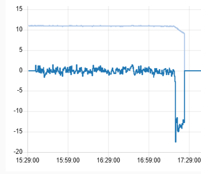
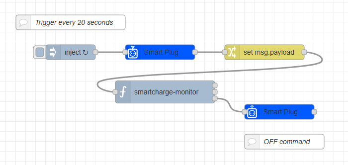

# Node-RED Contrib SmartCharge Monitor

**Node-RED custom node for intelligent monitoring and optimization of battery charging based on power consumption insights.**  
This node aims to bring **smart charging capabilities** to **non-smart lithium-based battery devices** that typically lack such features, including **electrical bikes, scooters, drones, power tools, vacuum cleaners, wireless mice, gaming controllers, portable speakers, power banks, and more**. While many **phones and laptops** now have built-in battery management systems, this node fills the gap for other devices by detecting the **exponential decay of the saturation stage** in the charging cycle through real-time monitoring of power consumption.

The idea is to prevent overcharging, extend battery life, and minimize energy waste.

> For more information on charging cycles, refer to [Battery University](https://batteryuniversity.com/article/bu-409-charging-lithium-ion).

**Requirements:** A connected power plug with power reading capability.
**Tested With:** Primarily tested with the [Meross smart plug](https://flows.nodered.org/node/node-red-contrib-meross) (MSS310 / MSS315), but should be compatible with other smart plugs that support power monitoring.

## 📦 Installation

To install the node, use the following command in your Node-RED user directory (typically `~/.node-red`):

```sh
npm install @bendenoz/node-red-smartcharge-monitor
```

## Usage

1. Drag the `smartcharge-monitor` node into your Node-RED flow.
2. Configure the node with the desired parameters, such as cutoff charge percentage.
3. Set up an inject timer at 20-second intervals to retrieve the power from your charger, and feed the numerical power data into the node's input.
4. Connect the third output of the node to the OFF command of your connected power plug.
5. Optionally use the first and second outputs to plot the charging power and rate of change for a detailed view of the charging process.



## 📊 Example Flow

Below is an example flow demonstrating how to integrate the smartcharge-monitor node:



## Configuration

- **Cutoff**: The target charge percentage to stop charging.
- **Charger Efficiency**: Specifies the efficiency of the charger. Used primarily to estimate the actual available power after charging.
- **Peak Charge**: Defines the battery state of charge from which the exponential decay phase becomes noticeable.

## How It Works

The `smartcharge-monitor` node uses a Kalman filter to refine power consumption data and accurately detect the _characteristic time constant_ of the exponential decay phase. When this time constant is within a valid range (typically around 1 hour), the node then wait for the power level to drop below the specified threshold before stopping the charging process.

## Contributing

Contributions are welcome! Please open an issue or submit a pull request on [GitHub](https://github.com/bendenoz/node-red-contrib-smartcharge-monitor).

## License

This project is licensed under the MIT License.
